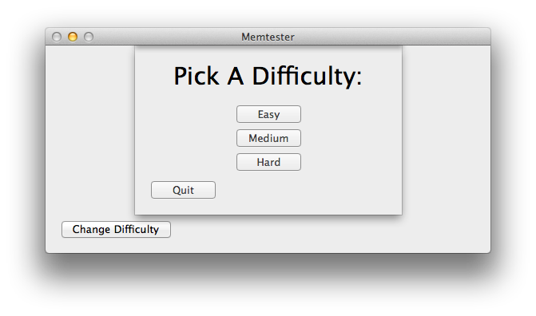
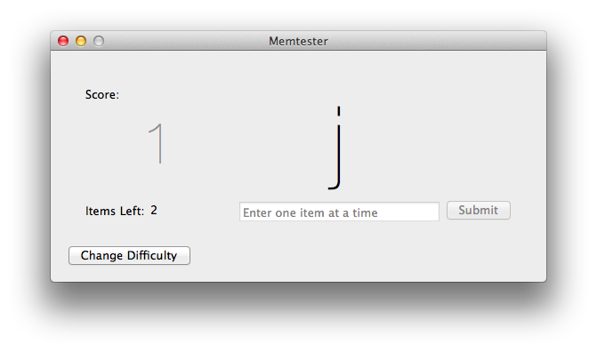

## What's MemTester - Mac?

It's a native Cocoa port of a game a friend of mine made a while ago. The game was written in Java and was therefore terrible (jk). MemTester - Mac is just a weekend project really. MemTester's a little memory testing game. It'll present you with a series of letters, numbers or characters depending on the difficulty and you'll have to memorise them and then re-enter them. Simple.

## What's completed in MemTester - Mac?

**The basics**. The game is playable. You can try out the varying difficulties and remember stuff. There's a few things that are in the original that aren't in the current version. High score saving hasn't been implemented. Won't be too hard to do, just haven't got around to it. The cheat mode hasn't been implemented in the user interface. All the code for it exists, I just haven't thought of a nice way of integrating it into the the user interface yet. 

MemTester - Mac differs a little bit to the Java version. In easy mode in the Java version, you press buttons correlating to the numbers you had to remember. The buttons light up in red too. In the native Mac version, you instead type out the numbers you need to remember. It's not as pug ugly as an array of red flashing buttons. 

## Where's The Original Version of MemTester

My friend has it on a GoogleCode page. There's a desktop version (that needs Java) and an Android version too. There's also source code.

[MemTester (Original)](https://code.google.com/p/mem-tester/)

## Screenshots

## License

My friend has it under the GNU GPL v3 license. Does that mean I have to? 